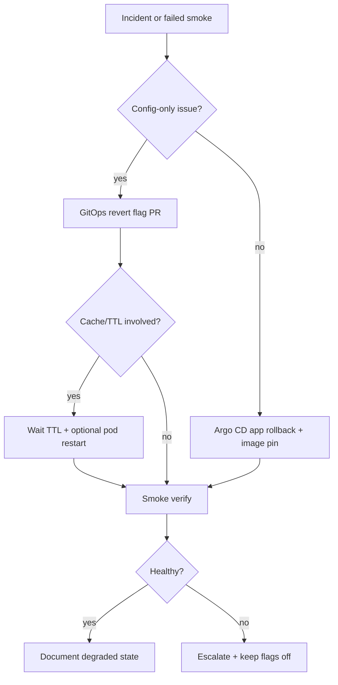

# Backend production rollback matrix (Faz 126)

Rollback actions for each flag family in [`backend-production-flag-flip-plan.md`](backend-production-flag-flip-plan.md). Use with the change request template when a wave fails validation or incident response requires revert.

**Principle:** Prefer **flag off** via GitOps revert before image rollback. Image/Argo rollback when code defect suspected.

---

## Rollback decision tree

---

## Matrix by flag family

| Family | Primary rollback | Argo / Helm | Pod restart? | Cache / TTL wait | Post-rollback smoke | Expected degraded state |
|--------|------------------|-------------|--------------|------------------|---------------------|-------------------------|
| **Break-glass enable** | `breakGlassEnabled=false` | Sync prod values | Optional identity pods | N/A | No new BG sessions; existing sessions expire by TTL | Emergency access unavailable until re-enabled |
| **Break-glass revocation** | `breakGlassRevocationEnabled=false` | Sync | Identity pods if revoke API stuck | Denylist rows remain in DB | Revoke API 404/disabled; tokens may work until TTL | Revoked jti may be accepted until denylist check off |
| **Gateway denylist** | `gatewayBreakGlassDenylistCheckEnabled=false` | Sync | Gateway rollout | **Wait `gatewayBreakGlassDenylistCacheSeconds` (default 30s)** | Revoked token may pass briefly | Denylist not enforced at gateway |
| **SCIM POC / remote fetch** | `scimDeltaRemoteFetchEnabled=false`, `scimDeltaProviderPocEnabled=false` | Sync | Identity pods | N/A | Diagnostics show disabled; no outbound fetch | SCIM delta diagnostics unavailable |
| **SCIM multi-page** | `scimDeltaRemoteMultiPageEnabled=false` | Sync | Identity | N/A | Single-page cap only if fetch still on | Reduced fetch coverage |
| **SCIM bearer secret** | `scimDeltaRemoteFetch.bearerTokenFromSecret.enabled=false` | Sync + remove mount | Identity | N/A | Fetch fails closed | Remote fetch non-functional |
| **Platform retention gov** | `platformRetentionGovernanceEnabled=false` | Sync | Gateway | N/A | Enterprise retention slice empty/warning | Aggregated plan missing |
| **Retention dry-run (per domain)** | Service `*_DRY_RUN_*=false` | Sync | Affected service | N/A | Domain warnings `*_DISABLED` | Domain omitted from platform plan |
| **Retention integration** | `*_INTEGRATION_ENABLED=false` | Sync | Gateway | N/A | Gateway plan excludes domain | Partial enterprise status |
| **Retention datasource** | `retentionDatasource.<svc>.enabled=false` | Sync | **Yes — service pods** (pool rebind) | Connection pool drain ~30–60s | Actuator health; dry-run uses primary DS | Counts use primary DB; may be slower |
| **Admin GitOps** | `adminGitopsPrEnabled=false`, `adminGitopsProvider=mock` | Sync | Identity | N/A | PR creation disabled | Manual GitOps only |
| **RBAC enforce** | `gatewayAdminRbacEnforce=false`, `adminRbacEnabled=false` | Sync | Gateway + identity | N/A | Legacy allowlist behavior | Coarse admin access until re-enforced |

---

## Detailed rollback steps

### 1. Flag kapatma (GitOps)

| Step | Action |
|------|--------|
| 1 | Revert merge commit or open PR setting target keys to `false` / safe default |
| 2 | Obtain same approvers as flip (or incident commander override) |
| 3 | Merge → Argo CD auto-sync (or manual sync) |
| 4 | Confirm ConfigMap env in running pods (`kubectl` describe / enterprise status) |

### 2. Argo CD rollback

| When | How |
|------|-----|
| Bad image + config | `argocd app rollback <app> <revision>` or UI history |
| Config good, code bad | Pin previous image digest in values; sync |

Document previous revision ID in CR.

### 3. Pod restart

| Flag change | Restart needed? |
|-------------|-----------------|
| Gateway env only | Gateway Deployment rollout (default on sync) |
| Identity break-glass / SCIM | Identity rollout |
| `retentionDatasource` toggle | **Yes** — Hikari pool binding at startup |
| Frontend env | Frontend rollout |

Forced restart only if sync did not roll pods (stuck ReplicaSet).

### 4. Cache TTL (break-glass denylist)

After disabling `GATEWAY_BREAK_GLASS_DENYLIST_CHECK_ENABLED`:

1. Wait **≥ `GATEWAY_BREAK_GLASS_DENYLIST_CACHE_SECONDS`** (default 30s).
2. Optionally scale gateway to clear in-memory cache sooner.
3. Re-run revocation drill smoke in staging before re-enabling in prod.

### 5. Smoke after rollback

| Area | Verification |
|------|----------------|
| Secrets | `bash scripts/check-no-secrets.sh` (repo); no token in logs |
| Defaults | `bash scripts/security/validate-production-flag-plan.sh` |
| Break-glass | Active sessions panel empty; metric `break_glass_active_sessions` → 0 |
| SCIM | Remote fetch metrics flat; admin cert status unchanged |
| Retention | `scripts/retention/ci-retention-smoke-fixtures.sh` logic via staging mirror |
| Bundle | Optional: rebuild bundle; expect `NO_GO` if evidence stale |

### 6. Expected degraded state (acceptable)

| Reverted capability | Acceptable until re-flip |
|--------------------|---------------------------|
| Break-glass | Normal admin MFA + standard ops only |
| SCIM delta remote | Manual IdP reconciliation |
| Retention dry-run | No cross-service retention plan in enterprise status |
| Datasource | Retention counts on primary DB only |
| GitOps PR | Manual infra PRs |

---

## Incident severity guide

| Severity | Rollback scope |
|----------|----------------|
| SEV1 — active breach / token leak | All BG + SCIM fetch off; rotate secrets; denylist fail-closed review |
| SEV2 — wrong data exposure | Affected integration off; preserve audit logs |
| SEV3 — metric noise / partial fail | Single domain dry-run off |

---

## Cross-links

- Break-glass: [`break-glass-runbook.md`](break-glass-runbook.md)
- Retention: per-service `*-retention-rls-production-runbook.md`
- SCIM: [`scim-delta-provider-certification.md`](scim-delta-provider-certification.md)
