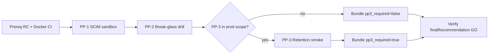

# Backend staging PP evidence execution plan (Faz 130)

Single operator runbook to close pre-prod blockers (Faz 124–125), produce a **`GO`** pre-prod evidence bundle, and attach artifacts to the production change request. **Does not enable production flags.**

Related:

| Doc | Role |
|-----|------|
| [backend-live-staging-pp-evidence-run-checklist.md](backend-live-staging-pp-evidence-run-checklist.md) | **Faz 132** operator checklist (live run + bundle) |
| [backend-staging-pp-secrets-governance.md](backend-staging-pp-secrets-governance.md) | **Faz 134** ownership, rotation, cleanup |
| [backend-staging-pp-secrets-setup.md](backend-staging-pp-secrets-setup.md) | **Faz 133** GitHub secrets + dispatch |
| [backend-preprod-evidence-bundle.md](backend-preprod-evidence-bundle.md) | Bundle schema |
| [backend-production-approval-gate.md](backend-production-approval-gate.md) | Go/no-go rules |
| [backend-production-flag-flip-plan.md](backend-production-flag-flip-plan.md) | Post-GO flag waves |
| [backend-production-change-request-template.md](backend-production-change-request-template.md) | CR template |

---

## Prerequisites (before PP execution)

| Gate | Command / workflow | Expected |
|------|-------------------|----------|
| Repo secrets scan | `bash scripts/check-no-secrets.sh` | PASS |
| RC readiness | `bash scripts/security/ci-backend-rc-readiness.sh` or **Backend RC Readiness** on `main` | `PASS` or `PASS_WITH_ENVIRONMENT_SKIPS` |
| Docker CI | `bash scripts/security/ci-backend-docker-check.sh` or **Backend Docker CI** on `main` | `PASS` |
| Staging deploy | Argo CD sync healthy; image tag recorded for RC | Green |
| Staging flags for drill | See per-PP sections (staging only) | Documented in CR |

Attach **RC** and **Docker CI** summaries to the CR even before PP runs (proves artifact quality).

---

## Execution order (mandatory sequence)



| Step | Action | Blocker if skipped |
|------|--------|-------------------|
| 0 | RC + Docker CI artifacts | Cannot claim release-ready backend |
| 1 | **PP-1** per provider (at least one `certified` for your IdP) | Bundle `NO_GO` |
| 2 | **PP-2** live drill | Bundle `NO_GO` |
| 3 | **PP-3** only if dedicated datasource in prod CR scope | Bundle `NO_GO` if required and missing |
| 4 | Build **backend pre-prod evidence bundle** | No unified go/no-go |
| 5 | CR attach + approval gate sign-off | No production flag flip |

Run providers **okta**, **entra**, and/or **generic** as needed; bundle PP-1 uses the artifact for the IdP you will enable in production.

---

## PP-1 — SCIM delta sandbox evidence

### Workflow

| Field | Value |
|-------|--------|
| **Workflow** | `SCIM Delta Readiness` (`.github/workflows/scim-delta-readiness.yml`) |
| **Trigger** | `workflow_dispatch` (or push to `staging` branch) |
| **Job** | `scim-delta-sandbox-evidence` |

### GitHub secrets (repository)

| Secret | Required | Purpose |
|--------|----------|---------|
| `SCIM_DELTA_SANDBOX_GATEWAY_BASE_URL` | Yes | Staging gateway base URL (no path) |
| `SCIM_DELTA_SANDBOX_ADMIN_ACCESS_TOKEN` | Yes | Platform admin JWT for diagnostics |

### GitHub variables (optional)

| Variable | Default | Purpose |
|----------|---------|---------|
| `SCIM_DELTA_SANDBOX_PROVIDER` | `okta` | Default provider when not using dispatch input |
| `SCIM_DELTA_SANDBOX_EXPECT_READY` | `false` | Set `true` to fail job on non-`certified` |

### Workflow dispatch inputs

| Input | Values | Notes |
|-------|--------|-------|
| `provider` | `okta` \| `entra` \| `generic` | Run once per IdP in scope |

### Staging cluster (before workflow)

| Item | Staging-only | Notes |
|------|--------------|-------|
| `SCIM_DELTA_PROVIDER_POC_ENABLED` | `true` | Diagnostics |
| `SCIM_DELTA_REMOTE_FETCH_ENABLED` | `true` | Dry-run fetch |
| `SCIM_DELTA_DRY_RUN_ONLY` | **`true`** | Mandatory |
| `scimDeltaRemoteFetch.bearerTokenFromSecret` | `enabled` + ExternalSecret | See [deploy/gitops/environments/staging/scim-delta-remote-fetch-enable.overlay.example.yaml](../deploy/gitops/environments/staging/scim-delta-remote-fetch-enable.overlay.example.yaml) |
| IdP bearer token | Vault / ExternalSecret only | **Never** commit token |

### Expected artifacts

| Artifact name | Files inside |
|---------------|--------------|
| `scim-delta-sandbox-evidence-{provider}` | `scim-delta-sandbox-evidence.json`, `scim-delta-certification-checklist.md`, `scim-delta-sandbox-summary.md` |

Normalize filename for bundle: **`scim-delta-sandbox-evidence.json`**.

### Expected JSON result (bundle pass)

| Field | Required value |
|-------|----------------|
| `certificationResult` | **`certified`** |
| `evidenceStatus` | `passed` (typical) |
| `dryRunOnly` | `true` |

| `certificationResult` | Bundle |
|----------------------|--------|
| `certified` | PP-1 **pass** |
| `needs-review` | PP-1 **fail** → `NO_GO` |
| `skipped` / missing file | PP-1 **missing** → `NO_GO` |
| `blocked` | PP-1 **fail** → `NO_GO` |
| `privacy_violation` | **NO_GO** (exit 3) |

### Provider-specific notes

| Provider | Dispatch `provider` | Checklist template |
|----------|---------------------|-------------------|
| Okta | `okta` | `bash scripts/scim/generate-scim-delta-certification-evidence-template.sh okta` |
| Microsoft Entra | `entra` | `... entra` |
| Generic SCIM | `generic` | `... generic` |

Certification criteria: [scim-delta-provider-certification.md](scim-delta-provider-certification.md).

### Failure handling

| Symptom | Action |
|---------|--------|
| Job skip: missing secrets | Configure GitHub secrets; re-run |
| `needs-review` | Fix staging config / IdP sandbox; re-run; do **not** bundle as GO |
| Privacy validator exit 3 | Remove forbidden patterns from evidence; fix sanitizer inputs |
| Readiness gap (`EXPECT_READY=true`) | Treat as release blocker until `certified` |

### Local alternative (secrets on operator machine only)

```bash
export SCIM_DELTA_SANDBOX_GATEWAY_BASE_URL=https://api.staging.example.com
export SCIM_DELTA_SANDBOX_ADMIN_ACCESS_TOKEN=<from-secret-manager>
export SCIM_DELTA_SANDBOX_PROVIDER=okta
bash scripts/scim/run-scim-delta-sandbox-evidence.sh
```

---

## PP-2 — Break-glass revocation drill

### Workflow

| Field | Value |
|-------|--------|
| **Workflow** | `Break-glass Revocation Readiness` (`.github/workflows/break-glass-revocation-readiness.yml`) |
| **Trigger** | **`workflow_dispatch` only** |
| **Job** | `break-glass-revocation-drill` |

### GitHub secrets

| Secret | Required | Purpose |
|--------|----------|---------|
| `BREAK_GLASS_STAGING_API_BASE_URL` | Yes | Staging gateway URL |
| `BREAK_GLASS_STAGING_ADMIN_ACCESS_TOKEN` | Yes | Admin JWT (MFA for revoke) |
| `BREAK_GLASS_STAGING_EMERGENCY_TOKEN` | One of | Static break-glass login |
| `BREAK_GLASS_STAGING_BREAK_GLASS_TOKEN` | One of | Pre-issued break-glass JWT |

### GitHub variables (optional)

| Variable | Default |
|----------|---------|
| `BREAK_GLASS_STAGING_TEST_ENDPOINT` | `/admin/enterprise/status` |
| `BREAK_GLASS_STAGING_IMAGE_TAG` | `staging` |

### Staging flags (drill only)

| Flag | Staging | Production flip plan |
|------|---------|----------------------|
| `BREAK_GLASS_ENABLED` | `true` | Wave 3 (approved) |
| `BREAK_GLASS_REVOCATION_ENABLED` | `true` | Wave 3 |
| `GATEWAY_BREAK_GLASS_DENYLIST_CHECK_ENABLED` | `true` | Wave 4 |
| `GATEWAY_BREAK_GLASS_ADMIN_ALLOWED` | `true` for drill routes | **Stay false in prod** unless separate approved CR |
| `BREAK_GLASS_ALLOW_ADMIN_WRITE` | **`false`** | **Forbidden in prod** |

See [break-glass-revocation-staging-drill.md](break-glass-revocation-staging-drill.md).

### Expected artifacts

| Artifact name | Files |
|---------------|-------|
| `break-glass-revocation-evidence` | `break-glass-revocation-evidence.json`, `break-glass-revocation-summary.md` |

### Expected JSON result (bundle pass)

| Field | Required value |
|-------|----------------|
| `result` | **`passed`** |
| `gatewayRejectStatus` | **`401`** |
| `gatewayRejectErrorCode` | **`BREAK_GLASS_TOKEN_REVOKED`** |

| `result` | Bundle |
|----------|--------|
| `passed` + correct error code | PP-2 **pass** |
| `skipped` | PP-2 **missing** → `NO_GO` |
| `failed` / `readiness-gap` | PP-2 **fail** → `NO_GO` |
| `privacy-failure` | **NO_GO** |

### Failure handling

| Symptom | Action |
|---------|--------|
| `skipped` (no secrets) | Configure secrets; re-run |
| `failed` (token still accepted) | Check denylist TTL/cache; verify gateway flags |
| Exit 5 | Fix drill until `passed` |

---

## PP-3 — Retention dedicated datasource E2E (conditional)

### Decision tree

```
Is retentionDatasource.*.enabled in the production change request?
├── NO  → PREPROD_PP3_REQUIRED=false / bundle pp3_required=false
│         PP-3 status: not_required → GO allowed if PP-1 + PP-2 pass
└── YES → Run PP-3; pp3_required=true
          Require overall.status=passed AND all domains[].status=passed
          Else NO_GO
```

Default for backend-only releases without dedicated retention DB: **`pp3_required=false`**.

### Workflow

| Field | Value |
|-------|--------|
| **Workflow** | `Retention Readiness` (`.github/workflows/retention-readiness.yml`) |
| **Trigger** | `workflow_dispatch` with **`run_staging_smoke: true`** |
| **Job** | `retention-staging-smoke` |

### GitHub secrets

| Secret | Required |
|--------|----------|
| `RETENTION_STAGING_API_BASE_URL` | Yes |
| `RETENTION_STAGING_ADMIN_ACCESS_TOKEN` | Yes |

### GitHub variables (when PP-3 required)

| Variable | Typical |
|----------|---------|
| `RETENTION_EXPECT_CONTENT_READY` | `true` |
| `RETENTION_EXPECT_NOTIFICATION_READY` | `true` |
| `RETENTION_EXPECT_WORKSPACE_READY` | `true` |
| `RETENTION_EXPECT_SEARCH_READY` | `true` |

### Staging prerequisites

| Item | Reference |
|------|-----------|
| `retentionDatasource.*.enabled` | Staging overlay only |
| ExternalSecret keys | [retention-datasource-ops-handoff.md](retention-datasource-ops-handoff.md) |
| RLS / BYPASSRLS | Domain runbooks under `docs/*-retention-rls-*` |
| E2E checklist | `scripts/retention/staging-dedicated-retention-e2e-checklist.md` |

### Expected artifacts

| Artifact name | Files |
|---------------|-------|
| `retention-staging-smoke-evidence` | `retention-staging-smoke-results.json`, `retention-staging-smoke-summary.md` |

### Expected JSON result (when required)

| Field | Required |
|-------|----------|
| `overall.status` | `passed` |
| Each `domains[].status` | `passed` |

---

## Step 4 — Build backend pre-prod evidence bundle

### Option A — GitHub Actions (recommended)

| Field | Value |
|-------|--------|
| **Workflow** | `Backend Pre-prod Evidence Bundle` |
| **Trigger** | `workflow_dispatch` |

| Input | When |
|-------|------|
| `release_candidate_id` | e.g. `rc-2026-05-17` |
| `pp3_required` | `true` only if PP-3 in prod scope |
| `use_fixture_inputs` | **`false`** for live evidence |
| `scim_artifact_name` | e.g. `scim-delta-sandbox-evidence-okta` (match PP-1 upload name) |

Workflow downloads artifacts from the same repository run (re-run workflow from a branch that has artifacts, or upload artifacts to a follow-up run — **download uses artifacts from current repo Actions storage**).

**Note:** GitHub `download-artifact` only sees artifacts from workflows in the **same repository**. Download PP artifacts first locally if combining across runs, then use Option B.

### Option B — Local bundle builder

1. Download workflow artifacts into directories.
2. Normalize inputs:

Prefer the Faz 135 orchestrator (pp-input layout):

```bash
bash scripts/security/run-backend-live-staging-pp-evidence.sh \
  --all \
  --rc-id rc-2026-05-17 \
  --provider okta \
  --pp3-required false \
  --output-base live-pp-evidence-out \
  --check-github \
  --wait-downloads
```

PP input paths:

- `pp-input/scim/scim-delta-sandbox-evidence.json`
- `pp-input/breakglass/break-glass-revocation-evidence.json`
- `pp-input/retention/retention-staging-smoke-results.json` (if PP-3)

Manual prepare + build:

```bash
bash scripts/security/prepare-backend-preprod-evidence-inputs.sh \
  --output live-pp-evidence-out/pp-input \
  --layout pp-input \
  --scim-dir ./downloads/scim-delta-sandbox-evidence-okta \
  --break-glass-dir ./downloads/break-glass-revocation-evidence \
  --strict

export PREPROD_BUNDLE_OUTPUT_DIR=live-pp-evidence-out
export PREPROD_SCIM_EVIDENCE_PATH=live-pp-evidence-out/pp-input/scim/scim-delta-sandbox-evidence.json
export PREPROD_BREAK_GLASS_EVIDENCE_PATH=live-pp-evidence-out/pp-input/breakglass/break-glass-revocation-evidence.json
bash scripts/security/build-backend-preprod-evidence-bundle.sh
```

### Expected bundle outcomes

| Condition | `finalRecommendation` |
|-----------|------------------------|
| PP-1 certified + PP-2 passed + PP-3 not_required | **`GO`** |
| PP-1 certified + PP-2 passed + PP-3 all domains passed | **`GO`** |
| Accepted risks documented in `PREPROD_ACCEPTED_RISKS_JSON` | `GO_WITH_ACCEPTED_RISKS` |
| Any PP missing/fail, privacy, shape mismatch | **`NO_GO`** |

### Output artifacts

| Name | Files |
|------|-------|
| `backend-preprod-evidence-bundle` | `backend-preprod-evidence-bundle.json`, `backend-preprod-evidence-summary.md` |

---

## Final CR attach list

Attach to production change request (with [backend-production-change-request-template.md](backend-production-change-request-template.md)):

| # | Artifact | Required |
|---|----------|----------|
| 1 | `backend-preprod-evidence-summary.md` | **Yes** |
| 2 | `backend-preprod-evidence-bundle.json` | **Yes** |
| 3 | `scim-delta-sandbox-evidence.json` (+ checklist/summary) | **Yes** |
| 4 | `break-glass-revocation-evidence.json` (+ summary) | **Yes** |
| 5 | `retention-staging-smoke-results.json` | If PP-3 in scope |
| 6 | `backend-rc-readiness-summary.md` | **Yes** |
| 7 | `backend-docker-ci-summary.md` | **Yes** |
| 8 | Faz 126 flag-flip wave CR (per family) | Before each prod enable |

Do **not** attach raw tokens, JWTs, JDBC URLs, or SCIM response bodies.

---

## Privacy and safety

- All evidence JSON is sanitized; validators grep forbidden patterns.
- If any artifact contains privacy violation → bundle **`NO_GO`**, exit **3**.
- Missing evidence is labeled **`missing`** in bundle — never implied as pass.

---

## What this plan does not do

- Enable production flags or GitOps prod value changes
- Run SCIM delta **scheduler** (`scimDeltaSyncEnabled` stays `false`)
- Enable destructive retention purge
- Auto-merge GitOps PRs

After **`GO`**, follow [backend-production-flag-flip-plan.md](backend-production-flag-flip-plan.md) one wave per CR.
